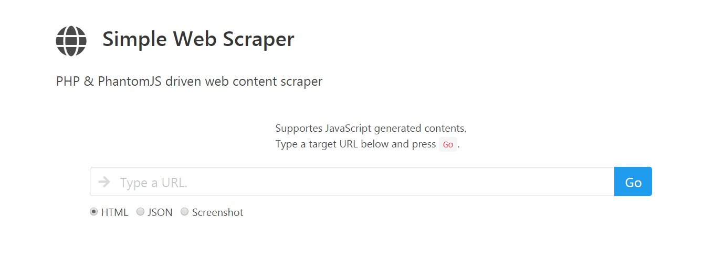

PHP Simple Web Scraper
==============================
A PHP application for Heroku, which can dump web site outputs including JavaScript generated contents.

<p align="center">
   
</p>

Demo
----

Visit [here](https://php-simple-web-scraper.herokuapp.com/). If the server is sleeping, it takes several seconds to wake up. 

Usage
----

### Basic Usage
Perform an HTTP request with the `url` query parameter and encoded URL as a value.

```
http(s)://{app-address}/?url={encoded target url}
```

#### Example
```
http(s)://{app-address}/?url=https%3A%2F%2Fgithub.com
```

### Parameters
#### output
Determines the output type, which includes `html`, `json`, `screenshot`.

##### _html_ (default)

HTML source code of the target web site. JavaScript generated contents are also retrieved and dumped.

##### _json_

`output=json`

HTTP response data as JSON. Useful for cross domain communications with JSONP.

###### Example
```
http(s)://{app-address}/?url=https%3A%2F%2Fgithub.com&output=json
```

##### _screenshot_

`output=screenshot`

A jpeg image of the site snapshot.

###### Example
```
http(s)://{app-address}/?url=https%3A%2F%2Fgithub.com&output=screenshot
```

#### file-type

When `screenshot` is given for the `output` parameter, the output file type can be set with the `file-type` parameter. Default: `jpg`. 

It accepts the following values: `pdf`, `png`, `jpg`, `jpeg`, `bmp`, `ppm`.

#### width
When `screenshot` is given for the `output` parameter, `width` sets the screenshot image width.  

#### height
When `screenshot` is given for the `output` parameter, `height` sets the screenshot image height. Leave it unset to get full height. The default minimum height is `720` pixels.

###### Example
```
http(s)://{app-address}/?url=https%3A%2F%2Fgithub.com&output=screenshot&file-type=png
```

#### user-agent
Sets a custom user agent. By default, the client's user agent accessing the app will be used. This can be changed by specifying the value with this parameter.

If `random` is given, the user-agent will be randomly assigned. 

##### Example
To set a user agent, `Mozilla/5.0 (Windows NT 6.1; Win64; x64; rv:57.0) Gecko/20100102 Firefox/57.0`, 
```
http(s)://{app-address}/?url=https%3A%2F%2Fwww.whatismybrowser.com%2Fdetect%2Fwhat-http-headers-is-my-browser-sending&user-agent=Mozilla/5.0%20(Windows%20NT%206.1;%20Win64;%20x64;%20rv:57.0)%20Gecko/20100102%20Firefox/57.0
```
```
http(s)://{app-address}/?url=https%3A%2F%2Fwww.whatismybrowser.com%2Fdetect%2Fwhat-http-headers-is-my-browser-sending&user-agent=random
```

#### load-images
Decides whether to load images. By default, this is disabled for the `html` and `json` output types. Enabled for the `screenshot` output type. 

Accepts a boolean value `true`, `false`, or `1`, `0`.

##### Example 
```
http(s)://{app-address}/?url=https%3A%2F%2Fwww.whatismybrowser.com%2Fdetect%2Fwhat-http-headers-is-my-browser-sending&user-agent=Mozilla/5.0%20(Windows%20NT%206.1;%20Win64;%20x64;%20rv:57.0)%20Gecko/20100102%20Firefox/57.0
```

#### output-encoding
Sets the encoding used for the output. Default: `utf8`

#### cache-lifespan
All requests are cached for 20 minutes by default. This detemines how long the cache should be retained. If you do not want a cached result or want to renew the cache, pass `0`. Default: `1200`.    

#### headers
Sets a custom HTTP headers. Accepts the value as an array.

##### Example
To set `DNT` value, 
```
http(s)://{app-address}/?url=https%3A%2F%2Fwww.whatismybrowser.com%2Fdetect%2Fwhat-http-headers-is-my-browser-sending&headers[DNT]=1
```

#### method
HTTP request method. Default: `GET`. Accepts the followings. 
 - OPTIONS
 - GET
 - HEAD
 - POST
 - PUT
 - DELETE
 - PATCH

When using `POST`, give sending post data with the `data` request key. The program checks `$_REQUEST[ 'data' ]` to send POST data.
##### Example  
```
http(s)://{app-address}/?url=http%3A%2F%2Fhttpbin.org%2Fpost&method=POST&data[foo]=bar
```

Run as Heroku Application
----
This is a Heroku application and meant to be deployed to a [Heroku](https://dashboard.heroku.com/) application instance.

### Requirements
- Heroku account
- [Heroku CLI](https://devcenter.heroku.com/articles/heroku-command-line)
- Git

### Steps to Deploy

#### a) Quick Deploy
You may simply use the following button to deploy this application: 

[](https://heroku.com/deploy)


#### b) Manual Deploy
1. Clone this repository to your local machine. Create a directory and from there, in a console window, type the following.
```
git clone https://github.com/michaeluno/php-simple-web-scraper.git
```
This will download the repository files.

2. Change the working directory to the cloned one.
```
cd php-simple-web-scraper
```

3. Login to Heroku from Heroku CLI. 
```
heroku login
```

4. Create a new Heroku app.
```
heroku create
```
This gives somehing like this with a random app name. `glacial-basin-46381` is the app name in the below example.
```
https://glacial-basin-46381.herokuapp.com/ | https://git.heroku.com/glacial-basin-46381.git
```

5. Type the following. Replace `{heroku-app-name}` with your app name given in the above step.
```
heroku git:remote -a {heroku-app-name}
```

6. Upload the files to Heroku.
```
git push heroku master
```

7. Open the app in your browser.
```
heroku open
```