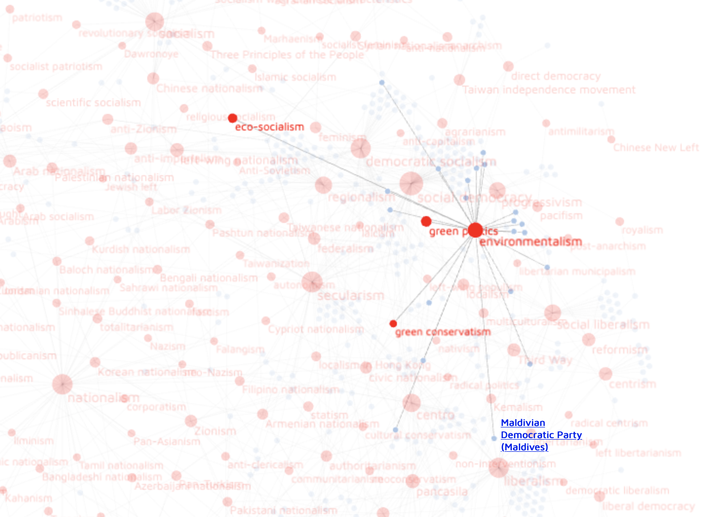

__Ideograph__ is a visual tool for exploring ideologies of political parties. It queries its data directly from the frequenty updated WikiData graph database. You can filter the graph by country. Cliking on the node labels allows you to find further information.

[Use it online](https://ourednik.info/ideograph).

[Read the documentation](https://ourednik.info/maps/2021/08/13/ideograph-explore-ideologies-of-political-parties-with-spaqrl-requests-to-wikidata-d3-and-pixijs/).

Ideograph is licenced under [GNU GPL 3.0](https://www.gnu.org/licenses/gpl-3.0.html).

